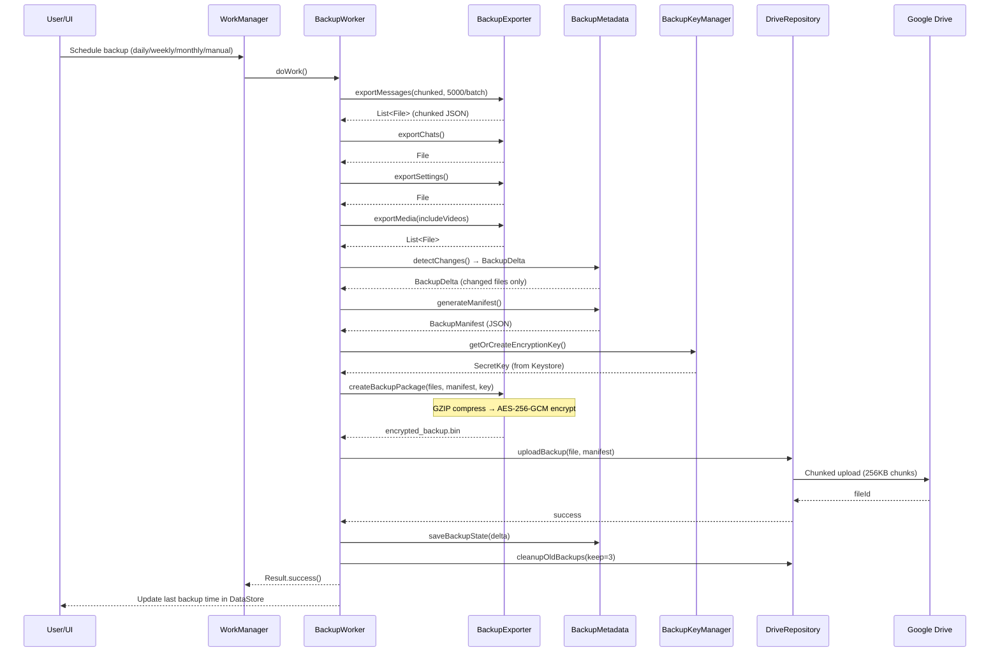
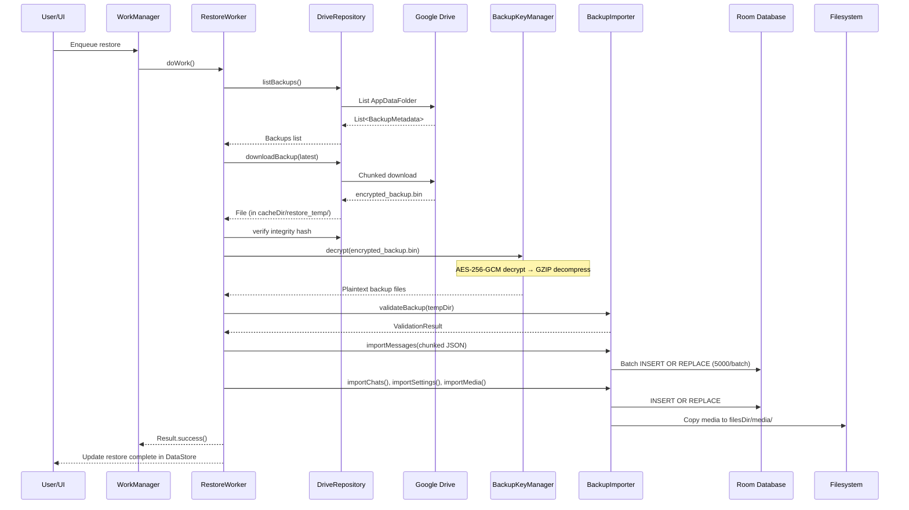

# GlyphV3 — Backup & Restore Implementation Plan

> **Status:** DRAFT — Awaiting review and approval before any code changes.
> **Date:** 2026-06-07
> **Analysis depth:** Full codebase audit of 23 repositories, 7 Room entities, 5 Workers, 40+ Activities, all settings/preferences layers, all media storage paths, and the entire auth stack.

---

## Table of Contents

1. [Executive Summary](#1-executive-summary)
2. [What This Plan Does NOT Touch](#2-what-this-plan-does-not-touch)
3. [Architecture Discovery Findings](#3-architecture-discovery-findings)
4. [New Dependencies Required](#4-new-dependencies-required)
5. [Implementation Phases](#5-implementation-phases)
   - [Phase 0: Google Sign-In Integration](#phase-0-google-sign-in-integration)
   - [Phase 1: Backup Engine Core](#phase-1-backup-engine-core)
   - [Phase 2: BackupWorker & Scheduling](#phase-2-backupworker--scheduling)
   - [Phase 3: Restore Engine](#phase-3-restore-engine)
   - [Phase 4: UI — Backup & Restore Screen](#phase-4-ui--backup--restore-screen)
   - [Phase 5: Onboarding Restore Flow](#phase-5-onboarding-restore-flow)
   - [Phase 6: Testing & Edge Cases](#phase-6-testing--edge-cases)
6. [Data Flow Diagrams](#6-data-flow-diagrams)
7. [File Inventory — New & Modified](#7-file-inventory--new--modified)
8. [Risk Assessment](#8-risk-assessment)

---

## 1. Executive Summary

The app currently has **zero data portability**. If a user uninstalls or switches phones, all chat history is lost permanently. Firebase is used only as a relay — messages are not stored permanently. The proposed system adds a WhatsApp-style encrypted Google Drive backup that:

- Runs periodically via WorkManager (daily/weekly/monthly/manual)
- Stores AES-256-GCM encrypted backups in Google Drive AppDataFolder
- Supports incremental backups (only changed/new data after first full backup)
- Handles 1M+ messages and 100GB+ media without OOM
- Respects battery, network, and Doze constraints
- Integrates with Google Sign-In for ownership validation
- Provides a modern Material 3 settings UI

---

## 2. What This Plan Does NOT Touch

These components are **completely unchanged** by this plan:

| Component | Reason |
|-----------|--------|
| `RealtimeMessageRepository.kt` — message send/receive/incoming/sync | Backup reads Room DB directly, not the repo |
| `GroupChatRepository.kt` — group creation/management | Same — reads Room |
| `FirebaseRepository.kt` | Unchanged |
| `PresenceManager.kt` | Unchanged |
| `StatusRepository.kt` | Statuses are ephemeral (24h), excluded from backup |
| `ChatActivity.kt` — UI, adapter, media loading | Unchanged |
| `MainActivity.kt` | Minor: add backup restore gate in splash flow only |
| All Workers (`DeliveryReceiptWorker`, `MediaDownloadWorker`, etc.) | Unchanged — backup is a separate WorkManager chain |
| All Compose screens except new Backup screen | Unchanged |
| ChatList, Groups, Calls, Status, Settings | Unchanged except 1 new settings entry point |
| WalkieTalkie, Live Audio, WebRTC | Unchanged |
| All Firebase RTDB/Firestore/Storage paths | Unchanged — backup goes to Google Drive, not Firebase |
| `MediaCompressor.kt`, `VideoNoteCompressor.kt` | Unchanged — backup reads already-compressed local files |
| `AppDatabase.kt` — Room schema, migrations | Unchanged (version stays at 35) |
| All DAOs | Used read-only by backup; NO schema changes |

---

## 3. Architecture Discovery Findings

### 3.1 What Already Exists

| Layer | Implementation | Used By Backup? |
|-------|---------------|-----------------|
| **Room DB** | AppDatabase v35, 7 entities, 7 DAOs | ✅ Read-only for backup export |
| **Messages** | `LocalMessage` — 28+ fields in `messages` table | ✅ Full export |
| **Chats** | `LocalChat` — 20 fields in `chats` table | ✅ Full export |
| **Call Logs** | `LocalCallLog` — `call_logs` table | ✅ Full export |
| **AI Messages** | `AiMessage` — `ai_messages` table | ✅ Full export |
| **Deleted Messages** | `LocalDeletedMessage` — delete markers | ✅ Export (needed for restore fidelity) |
| **Translation Cache** | `TranslationCache` — ephemeral, 7d TTL | ❌ Excluded (regenerated) |
| **Status Cache** | `CachedStatus` — ephemeral, 24h TTL | ❌ Excluded (ephemeral) |
| **Settings** | DataStore + SharedPreferences (per-chat) | ✅ Export all keys |
| **Media Files** | `filesDir/media/{images,videos,audio,thumbnails,documents}/{chatId}/` | ✅ Export (optional: exclude videos) |
| **WorkManager** | 5 workers, exponential backoff | ✅ New BackupWorker + RestoreWorker |
| **DI** | Manual singleton factory (`GlyphApplication.getOrCreate*()`) | ✅ Follow same pattern |
| **Coroutines** | `viewModelScope`, `Dispatchers.IO`, structured concurrency | ✅ Used throughout |
| **Keystore** | `KeyGenParameterSpec` available (used in SecuritySettings) | ✅ Used for backup encryption key |
| **Biometric** | `androidx.biometric` 1.1.0 | ✅ Optional: protect restore with biometric |

### 3.2 What Needs to Be ADDED

| Layer | Status | Action |
|-------|--------|--------|
| **Google Sign-In** | ❌ Not present | ⚠️ MUST ADD — Phase 0 prerequisite |
| **Google Drive API** | ❌ Not present | ⚠️ MUST ADD — Android Drive API + REST |
| **AES-256-GCM Encryption** | ❌ Not present | ⚠️ MUST ADD — javax.crypto (built-in) |
| **Streaming Compression** | ❌ Not present | ⚠️ MUST ADD — `java.util.zip.GZIPOutputStream` (built-in) |
| **Hilt DI** | ❌ Not present | ❌ NOT adding — follow manual singleton pattern |

### 3.3 Key Constraints

1. **NO Hilt** — All DI follows `GlyphApplication.getOrCreate*()` singleton pattern. We follow this.
2. **minSdk 26** — `java.util.zip`, `javax.crypto`, Android Keystore all available natively.
3. **No Google Sign-In exists** — This is the biggest prerequisite. Firebase Phone Auth is the only auth method. Google Sign-In must be added **alongside** (not replacing) phone auth.
4. **Media in `filesDir/media/`** — App-private storage, not accessible via SAF. Backup reads files directly.
5. **Large databases possible** — Must stream, never load entire DB into memory.

---

## 4. New Dependencies Required

Add to `app/build.gradle.kts`:

```kotlin
// Google Sign-In (for Google account + Drive auth)
implementation("com.google.android.gms:play-services-auth:21.3.0")

// Google Drive REST API (AppDataFolder access)
implementation("com.google.api-client:google-api-client-android:2.7.2")
implementation("com.google.apis:google-api-services-drive:v3-rev20250115-2.0.0")
implementation("com.google.http-client:google-http-client-gson:1.45.3")

// JSON serialization (for backup metadata/manifests)
// Already have Gson via Firebase — reuse
```

**No additional libraries needed for:**
- AES-256-GCM: `javax.crypto` (JDK built-in)
- GZIP: `java.util.zip` (JDK built-in)
- Android Keystore: `android.security.keystore` (SDK built-in)
- Streaming I/O: `java.io`, `kotlinx.coroutines` (already present)
- WorkManager: `androidx.work` (already present, v2.9+)
- DataStore: `androidx.datastore` (already present)

---

## 5. Implementation Phases

### Phase 0: Google Sign-In Integration

**Why this is Phase 0:** Google Drive AppDataFolder requires a Google account. Firebase Phone Auth alone cannot access Drive. We add Google Sign-In as an **additional linked identity**, not a replacement for phone auth.

#### 0.1 New File: `app/src/main/java/com/glyph/glyph_v3/data/auth/GoogleSignInRepository.kt`

```kotlin
class GoogleSignInRepository(private val context: Context) {
    private val googleSignInClient: GoogleSignInClient
    
    // Request silent sign-in (no UI prompt) on app start
    suspend fun silentSignIn(): GoogleSignInAccount?
    
    // Request interactive sign-in with account picker
    suspend fun signIn(activity: Activity): GoogleSignInAccount?
    
    // Sign out of Google account
    suspend fun signOut()
    
    // Get fresh OAuth token for Drive API
    suspend fun getDriveCredential(account: GoogleSignInAccount): Credential
    
    // Observe account state
    val signedInAccount: StateFlow<GoogleSignInAccount?>
    
    companion object {
        fun getInstance(context: Context): GoogleSignInRepository
    }
}
```

**Key design decisions:**
- GoogleSignInOptions request `Scopes.DRIVE_APPDATA` scope
- Uses `Credential` with automatic token refresh via `GoogleAccountCredential`
- Silent sign-in attempted on `GlyphApplication.onCreate()` — if user has Google account on device, it silently links
- Interactive sign-in only when user explicitly enables backup from settings
- Stores NOTHING in SharedPreferences (credentials managed by Google Play Services)

#### 0.2 Modified File: `GlyphApplication.kt`

- Add `GoogleSignInRepository` lazy initialization
- Call `googleSignInRepo.silentSignIn()` in `onCreate()` (fire-and-forget, best-effort)

**Risk:** Zero. Silent sign-in fails silently if no Google account on device. Phone auth continues working identically.

---

### Phase 1: Backup Engine Core

#### 1.1 New File: `app/src/main/java/com/glyph/glyph_v3/data/backup/BackupKeyManager.kt`

```kotlin
class BackupKeyManager(private val context: Context) {
    // Generate or retrieve AES-256 key from Android Keystore
    // Key alias: "glyph_backup_key_v1"
    // Key rotation support via versioned aliases
    suspend fun getOrCreateEncryptionKey(): SecretKey
    
    // Encrypt data with AES-256-GCM
    // Returns: IV (12 bytes) + ciphertext + GCM tag (16 bytes)
    suspend fun encrypt(plaintext: ByteArray): ByteArray
    
    // Decrypt data with AES-256-GCM
    suspend fun decrypt(ciphertext: ByteArray): ByteArray
    
    // Generate integrity HMAC-SHA256 for tamper detection
    fun generateIntegrityHash(data: ByteArray): ByteArray
    
    // Verify integrity hash
    fun verifyIntegrity(data: ByteArray, expectedHash: ByteArray): Boolean
    
    companion object {
        fun getInstance(context: Context): BackupKeyManager
    }
}
```

**Key details:**
- Uses `KeyGenParameterSpec.Builder("glyph_backup_key_v1", PURPOSE_ENCRYPT | PURPOSE_DECRYPT)`
- `setBlockModes(KeyProperties.BLOCK_MODE_GCM)`
- `setEncryptionPaddings(KeyProperties.ENCRYPTION_PADDING_NONE)`
- Key material NEVER leaves Keystore hardware (TEE/StrongBox)
- IV is randomly generated per encryption, prepended to output
- Key rotation: future versions use `glyph_backup_key_v2`, old keys retained for restore

#### 1.2 New File: `app/src/main/java/com/glyph/glyph_v3/data/backup/BackupMetadataManager.kt`

```kotlin
class BackupMetadataManager(private val context: Context) {
    // In-memory + DataStore-backed metadata tracking
    
    // Track file hashes for incremental backup detection
    data class FileHashEntry(
        val path: String,
        val sha256: String,
        val lastModified: Long,
        val size: Long
    )
    
    // Compute SHA-256 of a file (streaming, no full read)
    suspend fun computeFileHash(file: File): String
    
    // Compare current state vs last backup -> return changed files
    suspend fun detectChanges(): BackupDelta
    
    // Persist hash map after successful backup
    suspend fun saveBackupState(delta: BackupDelta)
    
    // Generate backup manifest (JSON)
    fun generateManifest(backupId: String, timestamp: Long, delta: BackupDelta): BackupManifest
    
    companion object {
        fun getInstance(context: Context): BackupMetadataManager
    }
}
```

#### 1.3 New File: `app/src/main/java/com/glyph/glyph_v3/data/backup/BackupExporter.kt`

```kotlin
class BackupExporter(private val context: Context) {
    // ===== DATABASE EXPORT =====
    
    // Export messages table — cursor-based streaming, chunked
    // Chunk size: 5000 rows per file
    suspend fun exportMessages(outputDir: File, progress: Flow<Float>): List<File>
    
    // Export chats table — single file (small)
    suspend fun exportChats(outputDir: File): File
    
    // Export call logs
    suspend fun exportCallLogs(outputDir: File): File
    
    // Export AI messages
    suspend fun exportAiMessages(outputDir: File): File
    
    // Export deleted messages markers
    suspend fun exportDeletedMessages(outputDir: File): File
    
    // ===== SETTINGS EXPORT =====
    
    // Export all DataStore preferences as JSON
    suspend fun exportAppSettings(outputDir: File): File
    
    // Export all per-chat SharedPreferences as JSON
    suspend fun exportChatSettings(outputDir: File): File
    
    // Export chat wallpaper assignments
    suspend fun exportWallpapers(outputDir: File): File
    
    // ===== MEDIA EXPORT =====
    
    // Export media files — copies with dedup by hash
    // includeVideos: Boolean — user preference
    suspend fun exportMedia(outputDir: File, includeVideos: Boolean, progress: Flow<Float>): List<File>
    
    // ===== PACKAGING =====
    
    // Create backup package: compress + encrypt all exported files
    // Uses streaming GZIP + streaming AES-256-GCM
    suspend fun createBackupPackage(
        exportedFiles: List<File>,
        manifest: BackupManifest,
        encryptionKey: SecretKey,
        outputFile: File,
        progress: Flow<Float>
    ): File
    
    companion object {
        fun getInstance(context: Context): BackupExporter
    }
}
```

**Anti-OOM measures:**
- Database export: `SELECT * FROM messages WHERE chatId = ? ORDER BY timestamp` with `OFFSET/LIMIT` batches of 5,000 rows
- Never loads entire `messages` table into memory
- JSON serialization via streaming `JsonWriter` (android.util.JsonWriter)
- Media files: copied one at a time via `FileChannel.transferTo()` (zero-copy)
- GZIP: `GZIPOutputStream` wrapping a `FileOutputStream`, fed in 64KB chunks
- AES-GCM: `CipherOutputStream` wrapping GZIP, also chunked

#### 1.4 New File: `app/src/main/java/com/glyph/glyph_v3/data/backup/DriveRepository.kt`

```kotlin
class DriveRepository(private val context: Context) {
    private val drive: com.google.api.services.drive.Drive
    
    // ===== UPLOAD =====
    
    // Upload a file to AppDataFolder with chunked resumable upload
    // Chunk size: 256KB per chunk (Drive minimum)
    suspend fun uploadFile(
        file: File,
        mimeType: String,
        progress: Flow<Float>
    ): String  // Returns Drive file ID
    
    // Upload backup package with metadata
    suspend fun uploadBackup(backupFile: File, manifest: BackupManifest, progress: Flow<Float>): String
    
    // ===== DOWNLOAD =====
    
    // List available backups in AppDataFolder
    suspend fun listBackups(): List<BackupMetadata>
    
    // Download a backup file with chunked resumable download
    suspend fun downloadBackup(fileId: String, outputFile: File, progress: Flow<Float>)
    
    // ===== MANAGEMENT =====
    
    // Delete old backup versions (keep latest + previous + rollback)
    suspend fun cleanupOldBackups(retentionCount: Int = 3)
    
    // Get total storage used in AppDataFolder
    suspend fun getStorageUsage(): Long
    
    // Estimate backup size before upload
    suspend fun estimateBackupSize(includeVideos: Boolean): Long
    
    companion object {
        fun getInstance(context: Context): DriveRepository
    }
}
```

**Drive API details:**
- `parents = ["appDataFolder"]` — hidden folder, user cannot see/modify
- `fields = "id, name, size, createdTime, modifiedTime, md5Checksum"`
- Resumable upload via `MediaHttpUploader` with `setDirectUploadEnabled(false)`
- Exponential backoff on upload failures: 1s, 2s, 4s, 8s, 16s (max 5 retries)
- Token refresh handled by `GoogleAccountCredential` automatically
- Quota errors detected via `HttpResponseException` 403 with "storageQuotaExceeded"

---

### Phase 2: BackupWorker & Scheduling

#### 2.1 New File: `app/src/main/java/com/glyph/glyph_v3/data/backup/BackupWorker.kt`

```kotlin
@HiltWorker // Actually uses manual DI via GlyphApplication pattern
class BackupWorker(
    context: Context,
    params: WorkerParameters
) : CoroutineWorker(context, params) {
    
    override suspend fun doWork(): Result {
        // 1. Verify Google account signed in
        // 2. Verify network policy (WiFi only check)
        // 3. Determine full vs incremental
        // 4. Export database (chunked)
        // 5. Export settings
        // 6. Export media (respect includeVideos)
        // 7. Create backup package (compress + encrypt)
        // 8. Upload to Drive
        // 9. Update metadata hashes
        // 10. Cleanup old backups
        // 11. Update last backup timestamp in DataStore
        
        return Result.success()
    }
    
    // Foreground service info for long-running backups
    override suspend fun getForegroundInfo(): ForegroundInfo
    
    companion object {
        const val UNIQUE_WORK_NAME = "glyph_backup_periodic"
        
        fun schedule(context: Context, frequency: BackupFrequency, networkPolicy: NetworkPolicy) {
            val constraints = Constraints.Builder()
                .setRequiredNetworkType(when (networkPolicy) {
                    NetworkPolicy.WIFI_ONLY -> NetworkType.UNMETERED
                    NetworkPolicy.WIFI_MOBILE -> NetworkType.CONNECTED
                })
                .setRequiresBatteryNotLow(true)
                .build()
            
            val request = PeriodicWorkRequestBuilder<BackupWorker>(
                frequency.durationMinutes, TimeUnit.MINUTES
            )
                .setConstraints(constraints)
                .setBackoffCriteria(BackoffPolicy.EXPONENTIAL, 1, TimeUnit.MINUTES)
                .addTag("glyph_backup")
                .build()
            
            WorkManager.getInstance(context).enqueueUniquePeriodicWork(
                UNIQUE_WORK_NAME,
                ExistingPeriodicWorkPolicy.UPDATE,
                request
            )
        }
        
        fun enqueueManualBackup(context: Context) {
            val request = OneTimeWorkRequestBuilder<BackupWorker>()
                .setExpedited(OutOfQuotaPolicy.RUN_AS_NON_EXPEDITED_WORK_REQUEST)
                .addTag("glyph_backup_manual")
                .build()
            
            WorkManager.getInstance(context).enqueue(request)
        }
        
        fun cancel(context: Context) {
            WorkManager.getInstance(context).cancelUniqueWork(UNIQUE_WORK_NAME)
        }
    }
}
```

#### 2.2 New File: `app/src/main/java/com/glyph/glyph_v3/data/backup/BackupPreferences.kt`

```kotlin
// DataStore-based backup settings
object BackupPreferences {
    // Keys
    private val KEY_BACKUP_ENABLED = booleanPreferencesKey("backup_enabled")
    private val KEY_BACKUP_FREQUENCY = stringPreferencesKey("backup_frequency") // "daily"|"weekly"|"monthly"|"manual"
    private val KEY_BACKUP_NETWORK = stringPreferencesKey("backup_network") // "wifi"|"wifi_mobile"
    private val KEY_BACKUP_INCLUDE_VIDEOS = booleanPreferencesKey("backup_include_videos")
    private val KEY_LAST_BACKUP_TIME = longPreferencesKey("last_backup_time")
    private val KEY_LAST_BACKUP_SIZE = longPreferencesKey("last_backup_size")
    private val KEY_NEXT_BACKUP_TIME = longPreferencesKey("next_backup_time")
    private val KEY_GOOGLE_ACCOUNT_EMAIL = stringPreferencesKey("backup_google_account")
    
    // Flow accessors
    fun backupEnabledFlow(context: Context): Flow<Boolean>
    fun backupFrequencyFlow(context: Context): Flow<BackupFrequency>
    fun lastBackupTimeFlow(context: Context): Flow<Long>
    fun lastBackupSizeFlow(context: Context): Flow<Long>
    
    // Suspending setters
    suspend fun setBackupEnabled(context: Context, enabled: Boolean)
    suspend fun setBackupFrequency(context: Context, frequency: BackupFrequency)
    // ... etc
    
    enum class BackupFrequency(val durationMinutes: Long) {
        DAILY(1440L),
        WEEKLY(10080L),
        MONTHLY(43200L),
        MANUAL(0L)
    }
    
    enum class NetworkPolicy {
        WIFI_ONLY,
        WIFI_MOBILE
    }
}
```

**When backup is enabled:**
1. `BackupWorker.schedule()` is called with user's frequency + network policy
2. When frequency changes, `ExistingPeriodicWorkPolicy.UPDATE` replaces the old schedule
3. When backup is disabled, `BackupWorker.cancel()` stops the periodic work
4. Manual backup always uses `OneTimeWorkRequest` with `ExistingWorkPolicy.REPLACE`

---

### Phase 3: Restore Engine

#### 3.1 New File: `app/src/main/java/com/glyph/glyph_v3/data/backup/RestoreWorker.kt`

```kotlin
class RestoreWorker(
    context: Context,
    params: WorkerParameters
) : CoroutineWorker(context, params) {
    
    override suspend fun doWork(): Result {
        // 1. List backups in Drive
        // 2. Download latest backup
        // 3. Verify integrity hash
        // 4. Decrypt
        // 5. Decompress
        // 6. Restore messages (batch insert, 5000 at a time)
        // 7. Restore chats
        // 8. Restore call logs
        // 9. Restore AI messages
        // 10. Restore deleted message markers
        // 11. Restore settings (DataStore)
        // 12. Restore per-chat settings (SharedPreferences)
        // 13. Restore media files
        // 14. Report progress via DataStore for UI observation
        
        return Result.success()
    }
    
    companion object {
        fun enqueueRestore(context: Context): UUID {
            val request = OneTimeWorkRequestBuilder<RestoreWorker>()
                .setExpedited(OutOfQuotaPolicy.RUN_AS_NON_EXPEDITED_WORK_REQUEST)
                .setBackoffCriteria(BackoffPolicy.EXPONENTIAL, 1, TimeUnit.MINUTES)
                .addTag("glyph_restore")
                .build()
            
            WorkManager.getInstance(context).enqueue(request)
            return request.id
        }
        
        fun observeProgress(context: Context, workId: UUID): Flow<RestoreProgress>
    }
}
```

#### 3.2 New File: `app/src/main/java/com/glyph/glyph_v3/data/backup/BackupImporter.kt`

```kotlin
class BackupImporter(private val context: Context) {
    // ===== VALIDATION =====
    
    // Verify backup integrity before restore
    suspend fun validateBackup(backupDir: File): ValidationResult
    
    // ===== DATABASE IMPORT =====
    
    // Restore messages — batch insert with conflict resolution
    // Strategy: INSERT OR REPLACE (idempotent)
    // Preserves existing messages not in backup
    suspend fun importMessages(sourceDir: File, progress: Flow<Float>)
    
    // Restore chats
    suspend fun importChats(sourceDir: File)
    
    // Restore call logs, AI messages, deleted markers
    suspend fun importCallLogs(sourceDir: File)
    suspend fun importAiMessages(sourceDir: File)
    suspend fun importDeletedMessages(sourceDir: File)
    
    // ===== SETTINGS IMPORT =====
    
    // Restore DataStore preferences (merge, not overwrite)
    suspend fun importAppSettings(sourceDir: File)
    
    // Restore per-chat SharedPreferences
    suspend fun importChatSettings(sourceDir: File)
    
    // ===== MEDIA IMPORT =====
    
    // Restore media files to filesDir/media/
    suspend fun importMedia(sourceDir: File, progress: Flow<Float>)
    
    // ===== ROLLBACK =====
    
    // If restore fails, revert to pre-restore state
    // Strategy: backup was imported to a temp DB first, atomically swapped
    suspend fun rollback()
    
    companion object {
        fun getInstance(context: Context): BackupImporter
    }
}

data class ValidationResult(
    val isValid: Boolean,
    val backupId: String,
    val backupTime: Long,
    val messageCount: Long,
    val chatCount: Int,
    val mediaCount: Int,
    val totalSizeBytes: Long,
    val error: String? = null
)
```

**Restore safety guarantees:**
1. Restore downloads to a **temporary directory** (`cacheDir/restore_temp/`)
2. Database is validated before any writes
3. Messages use `INSERT OR REPLACE` — existing messages with same ID are overwritten, new messages added
4. **Never deletes existing data** — restore is additive/update only
5. Settings are **merged** with current — restore doesn't clear settings not in backup
6. Media files are copied with dedup check — skip if already present locally
7. If any step fails, `rollback()` removes partially restored data
8. Progress reported via DataStore → UI observes via Flow

---

### Phase 4: UI — Backup & Restore Screen

#### 4.1 New File: `app/src/main/java/com/glyph/glyph_v3/ui/settings/BackupSettingsScreen.kt`

**Compose-based Material 3 screen** with these sections:

```
┌──────────────────────────────────┐
│  ← Backup & Restore              │
├──────────────────────────────────┤
│  Google Account                  │
│  ┌──────────────────────────┐    │
│  │ 👤 example@gmail.com  [✕]│    │
│  └──────────────────────────┘    │
│  [Not signed in — Sign in]       │
├──────────────────────────────────┤
│  Last Backup                     │
│  Today at 2:30 AM • 245 MB       │
│  Next: Tomorrow at 2:00 AM       │
├──────────────────────────────────┤
│  Backup Settings                 │
│  ┌──────────────────────────┐    │
│  │ Backup enabled    [toggle]│   │
│  │ Frequency      Daily  ▾  │    │
│  │ Network    Wi-Fi only ▾  │    │
│  │ Include videos   [toggle]│    │
│  └──────────────────────────┘    │
├──────────────────────────────────┤
│  [🔄  Back Up Now]               │
│  [📥  Restore from Backup]       │
└──────────────────────────────────┘
```

**Key UI behaviors:**
- Google account picker with multiple account support
- Toggle enables/disables periodic WorkManager
- Frequency dropdown: Daily / Weekly / Monthly / Manual only
- Network dropdown: Wi-Fi only / Wi-Fi + Mobile Data
- "Back Up Now" triggers manual `OneTimeWorkRequest`
- "Restore" shows confirmation dialog with backup details, then triggers `RestoreWorker`
- Progress bar during backup/restore operations
- Error states with retry buttons
- Storage usage display with cleanup button

#### 4.2 Modified File: `app/src/main/java/com/glyph/glyph_v3/ui/settings/SettingsFragment.kt`

- Add "Backup & Restore" menu item → navigates to `BackupSettingsScreen`
- Add backup status summary (last backup time, size) in the settings list item subtitle

---

### Phase 5: Onboarding Restore Flow

#### 5.1 Modified File: `app/src/main/java/com/glyph/glyph_v3/SplashActivity.kt`

Current flow:
```
SplashActivity → check auth → LoginActivity OR MainActivity
```

New flow:
```
SplashActivity → check auth
  ├─ Not authenticated → LoginActivity → SetupProfileActivity → MainActivity
  └─ Authenticated
       ├─ Check for Google Drive backup (silent Google sign-in)
       │   ├─ Backup found + not restored before → Show RestoreOfferActivity
       │   │   ├─ User accepts → RestoreWorker → MainActivity
       │   │   └─ User declines → MainActivity
       │   └─ No backup → MainActivity
       └─ No Google account → MainActivity
```

#### 5.2 New File: `app/src/main/java/com/glyph/glyph_v3/ui/onboarding/RestoreOfferActivity.kt`

- Simple screen showing backup details (date, size, message count)
- "Restore" button → triggers `RestoreWorker`, shows progress
- "Skip" button → goes to MainActivity
- Shows progress bar during restore
- On completion → navigates to MainActivity

---

### Phase 6: Testing & Edge Cases

#### 6.1 Unit Tests

| Test Class | What It Tests |
|------------|--------------|
| `BackupKeyManagerTest` | Key generation, encrypt/decrypt roundtrip, integrity hash verification, key rotation |
| `BackupMetadataManagerTest` | File hashing, delta detection, manifest generation |
| `BackupExporterTest` | Database export (chunked), settings export, manifest creation |
| `BackupImporterTest` | Database import, settings merge, validation |
| `BackupPreferencesTest` | DataStore read/write for all backup settings |

#### 6.2 Integration Tests

| Test Class | What It Tests |
|------------|--------------|
| `BackupWorkerTest` | Full backup → upload → download → restore cycle with mock Drive |
| `RestoreEdgeCasesTest` | Corrupted backup, interrupted upload, interrupted restore, account change |

#### 6.3 Edge Cases Handled

| Edge Case | Handling |
|-----------|----------|
| **1M+ messages** | Cursor-based chunking, 5000 rows per batch, never loads full table |
| **100GB+ media** | One file at a time, streaming copy, no in-memory accumulation |
| **Network interruption** | WorkManager retry with exponential backoff, resumable uploads |
| **Google auth expiration** | `GoogleAccountCredential` auto-refresh, Worker retries |
| **Device reboot during backup** | WorkManager persists work, resumes on reboot |
| **Process death** | WorkManager guarantees at-least-once execution |
| **Insufficient Drive storage** | Pre-check quota, show error to user, suggest cleanup |
| **Drive quota exceeded** | Catch 403, stop backup, notify user |
| **Corrupted backup** | Integrity hash verification before restore, rollback on failure |
| **Account change** | Backup ownership validated via Google account email in manifest |
| **Concurrent backup + restore** | Mutex via WorkManager unique work policy (one at a time) |
| **Battery saver** | `setRequiresBatteryNotLow(true)` |
| **Doze mode** | WorkManager handles Doze automatically |
| **No Google account** | Backup disabled, UI shows "Sign in with Google" prompt |
| **User clears app data** | Backup survives in Google Drive, restore after reinstall |
| **Large individual files** | Chunked upload (256KB chunks), resumable |

---

## 6. Data Flow Diagrams

### 6.1 Backup Flow



### 6.2 Restore Flow



---

## 7. File Inventory — New & Modified

### New Files (11)

| # | File Path | Purpose | Phase |
|---|-----------|---------|-------|
| 1 | `data/auth/GoogleSignInRepository.kt` | Google Sign-In + Drive credential management | 0 |
| 2 | `data/backup/BackupKeyManager.kt` | AES-256-GCM encryption via Android Keystore | 1 |
| 3 | `data/backup/BackupMetadataManager.kt` | File hashing, delta detection, manifest generation | 1 |
| 4 | `data/backup/BackupExporter.kt` | Streaming DB export, media export, backup packaging | 1 |
| 5 | `data/backup/DriveRepository.kt` | Google Drive AppDataFolder CRUD | 1 |
| 6 | `data/backup/BackupWorker.kt` | WorkManager CoroutineWorker for backup | 2 |
| 7 | `data/backup/BackupPreferences.kt` | DataStore for backup settings | 2 |
| 8 | `data/backup/RestoreWorker.kt` | WorkManager CoroutineWorker for restore | 3 |
| 9 | `data/backup/BackupImporter.kt` | DB import, settings merge, media restore | 3 |
| 10 | `ui/settings/BackupSettingsScreen.kt` | Material 3 backup/restore settings Compose screen | 4 |
| 11 | `ui/onboarding/RestoreOfferActivity.kt` | First-launch restore offer screen | 5 |

### Modified Files (5)

| # | File Path | Change | Phase |
|---|-----------|--------|-------|
| 1 | `app/build.gradle.kts` | Add Google Sign-In + Drive API deps | 0 |
| 2 | `GlyphApplication.kt` | Add GoogleSignInRepository init, silent sign-in | 0 |
| 3 | `ui/settings/SettingsFragment.kt` | Add "Backup & Restore" menu item | 4 |
| 4 | `SplashActivity.kt` | Add backup detection + restore offer routing | 5 |
| 5 | `ui/login/LoginActivity.kt` | Add post-auth restore check (optional) | 5 |

### Files Read-Only (No Changes)

All Room entities, DAOs, AppDatabase, all repositories, all Workers, all Activities except listed above, all Compose screens except listed above, all util classes, all cache classes, all service classes.

---

## 8. Risk Assessment

| Risk | Probability | Impact | Mitigation |
|------|------------|--------|------------|
| **Google Sign-In rejected by Play Store review** | Low | High | Google Sign-In is standard; we request only `DRIVE_APPDATA` scope, not full Drive access. Phone auth remains primary. |
| **Drive API quota limits** | Low | Medium | AppDataFolder has 25GB free per user. Monitor usage, show quota to user, offer cleanup. |
| **Encryption key loss (device wipe)** | Medium | High | This is BY DESIGN — encryption key is device-bound. If user wipes device without backup key export, backup is unrecoverable. WhatsApp works identically. Document this clearly in UI. |
| **Large backup causes ANR** | Low | High | All heavy work is in WorkManager (background thread). UI only observes progress via Flow. |
| **Restore overwrites newer local data** | Low | High | `INSERT OR REPLACE` strategy. Backup timestamps compared with local timestamps. Settings are merged. Rollback on failure. |
| **Media file conflicts after restore** | Low | Medium | Dedup by hash. Files already present are skipped. File names encode messageId + hash + index. |
| **Migration from existing users (no prior backup)** | N/A | Low | First backup is a full backup. No migration needed — backup starts from scratch. |
| **Play Store policy: backup data privacy** | Low | Medium | All data is encrypted before upload. Google cannot read backup contents. Disclosed in privacy policy. |

---

## Summary

This plan adds ~11 new files and modifies ~5 existing files. It introduces **zero changes** to the message pipeline, chat UI, media pipeline, Firebase integration, or any existing feature. The backup system operates as a **parallel, read-only layer** on top of the existing Room database and filesystem.

**Total estimated new code:** ~3,500-4,500 lines of Kotlin (including tests).

**Prerequisite before ANY code changes:** Google API Console project configuration:
1. Enable Google Drive API in Google Cloud Console
2. Configure OAuth 2.0 consent screen
3. Add SHA-1 fingerprint of debug + release keystores
4. Enable "Google Sign-In" in Firebase Console (Authentication → Sign-in method)

---

**Please review this plan thoroughly. Once approved, I will begin implementation in the specified phase order.**
